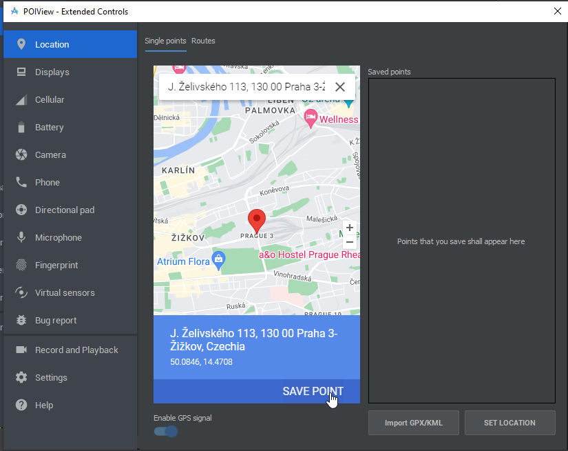
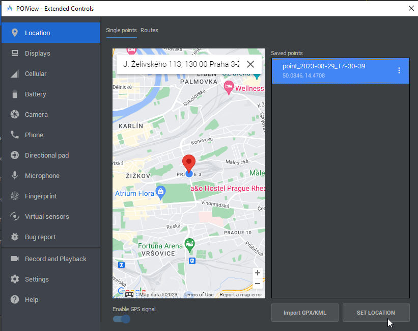

# Location

Access GPS location sample for Android 13.

We ask for current and last location in `onCreate()` function the sample.

For regular location updates see `startLocationUpdates()` function.

References:
- [Request location permissions](https://developer.android.com/training/location/permissions)
- [Request location updates](https://developer.android.com/training/location/request-updates)


## Simulation

To simulate location in AVD

- go to Settings > Location
- select some position by clicking on map and press *Save Point*

- select point from *Saved Points* ist and click to *Set Location* button


now run *Location* sample and in *Logcat* you should see

```
Current (last) location is 
lat : 50.0755367
long : 14.4378
fetched at 1693322851095
```

message.

