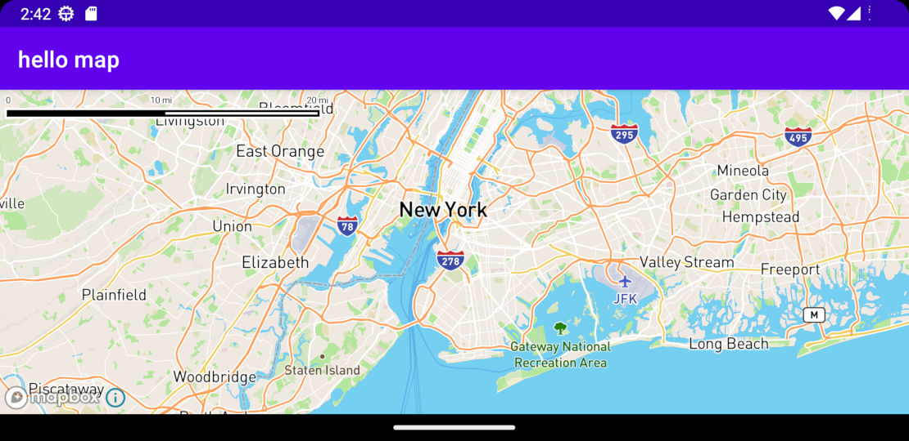

This directory contains Mapbox hello sample implementation from [Installation](https://docs.mapbox.com/android/maps/guides/install/) guide.

To get sample running configure secret token first.

- Open (or create) `~/.gradle/gradle.properties`
- define `MAPBOX_DOWNLOADS_TOKEN` variable with access token this way

```
MAPBOX_DOWNLOADS_TOKEN=YOUR_SECRET_MAPBOX_ACCESS_TOKEN
```

> for access token, create Mapbox account, then go to *Tokens* section and create token with `Downloads:Read` checked in a *Secret* section.


Then configure your public token.

- create dedicated public token for sample in Mapbox account
- define `mapbox_access_token` in `res/values/strings.xml` file this way

```xml
<string name="mapbox_access_token">pk.eyJ9IjoiYWRhbS6obGF2YXRvdmljIiwiUFV6ImNsY291Z3IwMzAyM2MzcHF5dmZ3b3J3OW8ifQ.Dn3oDvBJKVHgOKYcpeZyVA</string>
```

> **note**: token changed so it is save to publish ...
