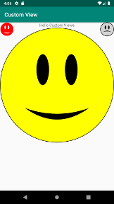
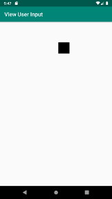
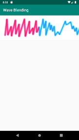
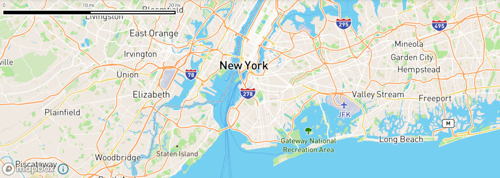

# Android

This repository contains Android samples for Kotlin and Java (now considered as secondclass citizen in Android ecosystem) languages.

## kotlin:samples

Kotlin language samples are saved in `kotlin` directory.

**GridView** : ukážka použitia `GridView` komponenty.

**ListView** : ukážka použitia `ListView` komponenty.

**TableLayout** : ukážka použitia dynamicky naplnenéj `TableLayout` komponenty. `TableLayout` je možné použiť pri zobrazovaní dát vo forme tabuľky (zdá sa, že android k tomuto účelu neimplementuje žiadnu štandardnú komponentu).

  

**ImageView** : ukážka práce s `ImageView` komponentou.

**SQLiteDatabase** : ukážka práce s SQLite databázou, aplykácia predvádza, ako spustiť aktyvitu a získať z nej dáta zadané užívateľom, ako vytvoriť menu, alebo aj ako použiť ListView.

  

**AndroidPlot** : ukážka renderovania grafou (xy plot) pomocou knižnice androidplot

**BarPlot** : ukážka renderovania bar grafu knižnicou androidplot.

**FXPlot**: vyzualizácia funkcie y=x^2-13 v android plot knižnici (negatívne hodnoty, grid, popisky)

  

**CombinedPlot** : ďalšie použitie knižnice androidplot 

**TabLayout** : použitie tabou a fragmentou v apke

**JeromqPush** : ukážka použitia push-pull ZMQ soketou

**jeromq/RouterDealerSample** : ukážka použitia router/dealer ZMQ soketou

**NavigationDrawer**: ukážka použitia `DrawerLayout` a `NavigationView` v ktorej sú jednotlivé volby (home, gallery, slideshow, ...) implementované ako fragmenty (`Fragment`). 

 

**Preferences** : ukážka dizajnu nastavení pomocou `PreferenceFragmentCompat` s fungujúcim summary.

**EmptyListPlaceholder**: ukážka ako na placeholder view v prípade prázdneho ListView, tiež ukazuje ako použiť FrameLayout.

**ExternalStorage**: The sample lists all photos from inside DCIM folder (usually /storage/emulated/0/DCIM) for Android 13+ which require runtime permission.

**RecyclerView**: použitie `RecyclerView` a `CardView` komponenty.

  

**UiThreadAccessWithoutActivity**: ako spúštať kód v UI vlákne bez aktivity (`Activity.runOnUiThread()`).

**HorizontalRecyclerView**: horizontálny `RecyclerView`.

**RecyclerViewDragandDrop**: ako na drag&drop u `RecyclerView`.

**RecyclerViewUpdate**: ukážka ako updateovať `RecyclerView` pri zmene zobrazovaných dát.

  

**SDCardDCIM**: Shows how to figure out image pathes stored in SD Card (not internal storage) via MediaStore API and list DCIM content from SD Card.

> tested under Android 33 API

**CustomView**: ukážka užívateľsky definovanéj `View` komponenty a kreslenia do `Canvas` pomocou `Paint`

**view/ViewUserInput**: ukážka implmentuje onTouchEvent() triedy View a na základe pohybu prstu po displeji mení pozíciu štvorca na displeji.

**canvas/PictureBlending**: ukážka kompozície dvoch bitmap pomocou `PorterDuffXfermode` kompozitora. 

**canvas/WaveBlending**: ukážka podfarbenia časového priebehu pomocou kompozitnej operácie ADD (`PorterDuff.Mode.ADD`). Čierny priebeh na priehľadnom pozadí zafarbený červenou (minulosť) a modrou (budúcnosť) farfou na základe pozície (v rozsahu 0 až 1.0).

   

**NotificationDemo**: Android 8 notifications sample
**NotificationProgress**: Notification with progress bar sample based on `NotificationDemo` sample.

### Mapbox

Directory `mapbox` with Mapbox's API samples for working with maps.

**hellomap**: Mapbox's *Hello World* sample for Android SDK.

**marker**: Mapbox's marker sample for Android SDK.

## ndk:samples

Ukážky predvádzajúce funkcionalitu JNI, dostupné v adresáry `jni`.

**HelloJni** : základná ukážka, volanie bezparametrickej funkcie implementovanej v jni.

**CMake** : ukážka použitia cmake (a standalone toolchain) na miesto štandardného ndk-build. Standalone toolchain je nutné najprv vygenerovať, pozri `android_tips.txt`.

**Cpp11** : jednoduchá ukážka demonštrujúca použitie c++11 kompatibilného kódu.

**LoadRes** : cez jni prečíta zdroje (assets) zbalené v apk súbore

**TriangleGles2** : trojuholník vyrenderovaný pomocou opengl es 2

ndk/LoadingPng : čítanie png pomocou libpng (staticky zlinkovana a predinštalovana v toolchaine)

ndk/LoadingJpeg : čítanie jpeg pomocoi libjpeg

ndk/ReadFile : čítanie s file systemu s jni

ndk/Shapes : generovanie tvarou pomocou kničnice shapes

ndk/Earth : sustava zem, mesiac slnko s osvetlenim a texturami

ndk/ImageMagick : galeria pomocou image-magick-u

ndk/OpenAL : prehrá zvuk pomocou knižnice openal

ndk/WaveformPlay : prehrá zvuk vo formáte wav (waveform)

ndk/VorbisPlay : prehrá zvuk vo formáte ogg/vorbis

ndk/Animation : gpu anymácia modelu (skinning)

ndk/AntApp

ndk/GradleApp

ndk/Bullet : streľba kociek voči stene v bullet-e

ndk/CustomNative

## java:samples (museum)

Lifecycle

OpenGLWindow

Service

TouchDemo1 : ukážka použitia dotykového displeja

MultiTouchDemo1 : ukážka použitia viacdotikového displeja

Galacticon : advanced RecyclerView sample

RecyclerView : most simple RecyclerView sample

RecyclerViewGallery : RecyclerView with image sample

**BarPlot** : ukážka renderovania bar grafu knižnicou androidplot.

**ndk/TwoSharedLibraries**: Použitie knižnice zo závislosťou na inej dynamickej knižnici.

Pri loadovaní prvej *native-lib* knižnice systém zistí jej závislosť na druhej knižnici *b* a sám ju natiahne (netreba volať `System.LoadLibrary()`).

**ndk/TwoSharedLibrariesInKotlin**: Použitie knižnice zo závislosťou na inej dynamickej knižnici v Kotline. Pozri popis `ndk/TwoSharedLibraries`.

